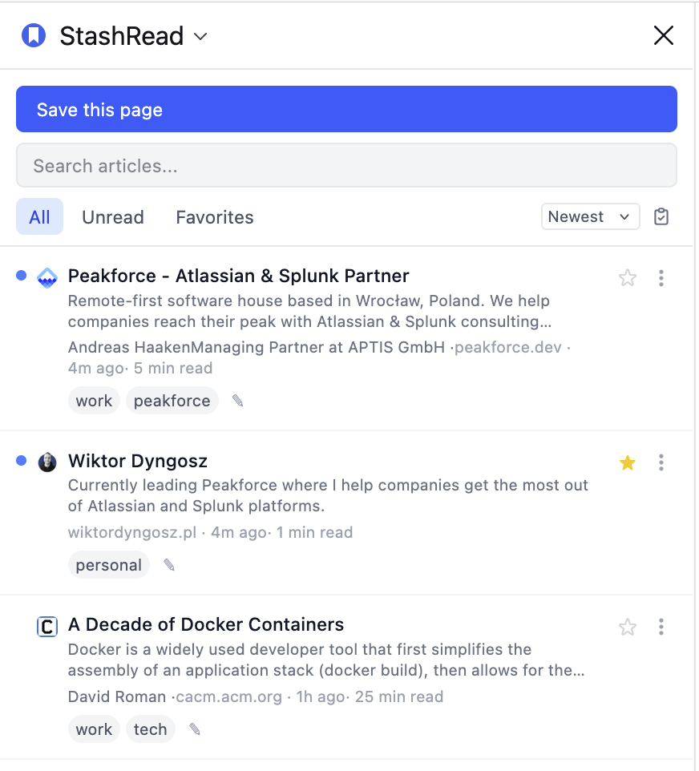
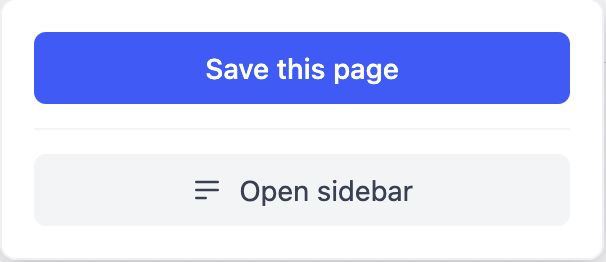

# StashRead

A Firefox extension for saving web articles to read later — and exporting them to Kindle as EPUB reading packs.

## Screenshots

**Sidebar — reading list**


**Popup — quick save from any tab**


## Why I built this

Pocket shut down in 2025. I needed a simple replacement that let me save articles while browsing Firefox, manage a reading list, and periodically export a batch of articles to my Kindle. I didn't want an account, a server, or a subscription — just a clean local tool that does exactly that and nothing more.

## How it works

Everything runs inside the browser. Articles are saved to `browser.storage.local` and never leave your machine. When you're ready to read on Kindle, you pick the articles you want, export them as a single EPUB file, and send it to your device manually or via email.

**Built with:**
- [WXT](https://wxt.dev/) — Firefox extension framework
- Svelte 5 — UI with runes (`$state`, `$derived`, `$effect`)
- TypeScript (strict mode)
- Tailwind CSS v4
- [@mozilla/readability](https://github.com/mozilla/readability) — article extraction
- [JSZip](https://stuk.github.io/jszip/) — EPUB generation

## Features

**Saving articles**
- Save the current tab with one click from the sidebar or keyboard shortcut (`Alt+S`)
- Right-click any link → *Save link to StashRead*
- Full article content is automatically extracted using Mozilla's Readability (the same engine as Firefox Reader View)

**Reading list sidebar**
- Browse saved articles with title, excerpt, domain, save date, estimated read time, and author
- Filter by All / Unread / Favorites
- Sort by newest, oldest, title, or domain
- Search across titles, URLs, domains, tags, and excerpts
- Mark articles as read/unread, favorite, or delete them
- Copy article URL to clipboard

**Tags**
- Add tags to any article inline, directly from the article card
- Define a personal tag library in Settings for quick one-click tagging
- Filter the article list by tag
- Filter EPUB exports by tag

**EPUB export**
- Select any articles (or all visible ones) and export as a single EPUB file
- Filter by tag before exporting so you can send topic-specific batches to Kindle
- Option to mark exported articles as read automatically
- Clean chapter-per-article layout with full extracted content

**Settings**
- Light / dark / system theme
- Extension badge showing unread count, total count, or nothing
- Manage your personal tag library
- Export and import a full JSON backup of your reading list

## Development

```bash
npm install
npm run dev        # Start with HMR (opens Firefox)
npm run build      # Production build
npm run zip        # Package for AMO submission
npm run test       # Run unit tests
npm run check      # Svelte type checking
```

## License

MIT
